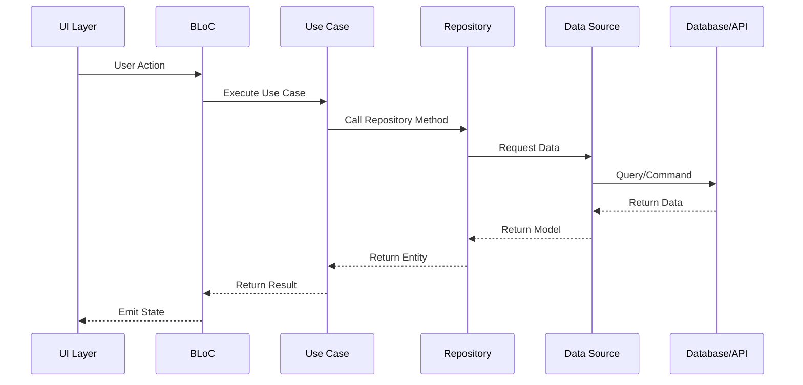
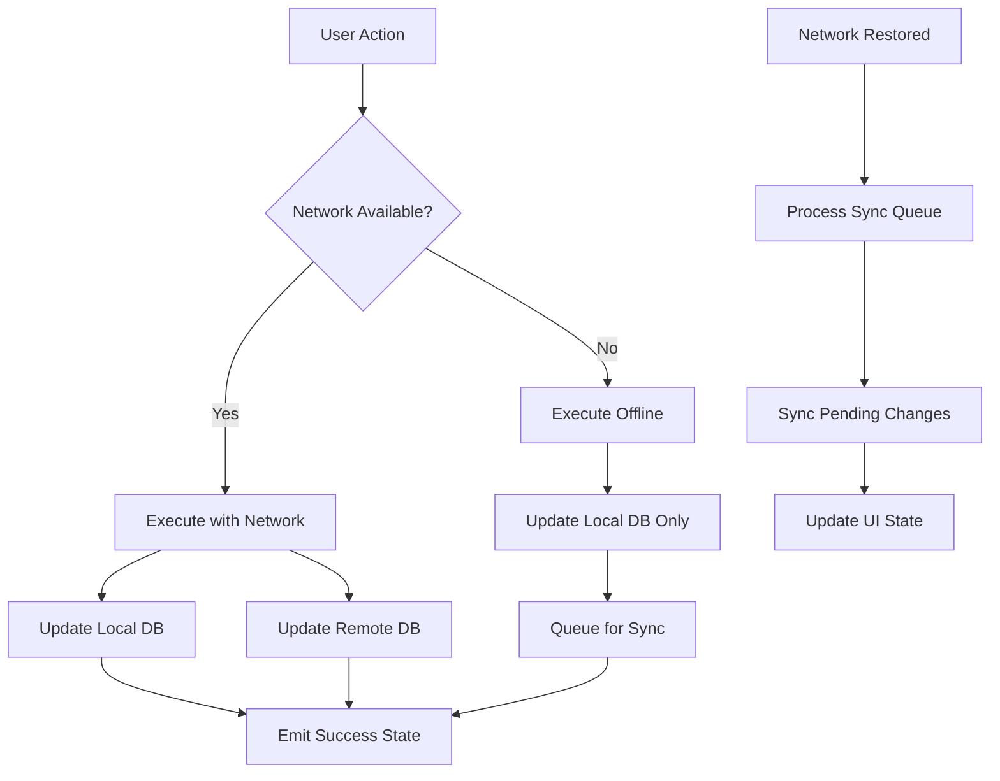

# CREATIVE PHASE: ARCHITECTURE DESIGN

🎨🎨🎨 ENTERING CREATIVE PHASE: ARCHITECTURE DESIGN 🎨🎨🎨

## Component Description
Design the system architecture for the TwinMind AI dictaphone clone, focusing on data flow, state management patterns, and component relationships. This includes the domain layer structure, data layer implementation, presentation layer organization, and integration patterns between local storage (Realm), cloud storage (Firebase), and AI services (OpenAI).

## Requirements & Constraints

### Functional Requirements
- **Offline-First Architecture**: Recording works without internet, sync when available
- **Real-time State Management**: Reactive UI updates for recording status, transcription progress
- **Data Synchronization**: Bidirectional sync between local Realm and Firebase Firestore
- **AI Integration**: Asynchronous processing of audio transcription and summary generation
- **Authentication Flow**: Google Sign-In integration with route guards
- **Background Processing**: Handle recording and AI processing in background
- **Error Handling**: Graceful degradation and retry mechanisms

### Technical Constraints
- **Framework**: Flutter 3.35.3 with Dart 3.9.2
- **State Management**: BLoC pattern for all features
- **Local Database**: Realm for offline storage
- **Cloud Database**: Firebase Firestore for sync
- **Authentication**: Firebase Auth + Google Sign-In
- **Navigation**: GoRouter for type-safe routing
- **Audio Processing**: flutter_sound for recording/playback
- **Network**: connectivity_plus for network status monitoring

### Performance Constraints
- **Memory Management**: Efficient handling of large audio files
- **Battery Optimization**: Minimize background processing impact
- **Network Efficiency**: Chunked uploads and compression
- **UI Responsiveness**: Non-blocking operations with proper loading states

## Multiple Options Analysis

### Option 1: Clean Architecture with Repository Pattern
**Description**: Traditional clean architecture with clear separation of concerns using repository pattern

**Architecture Structure**:
```
┌─────────────────────────────────────────┐
│           PRESENTATION LAYER            │
│  ┌─────────────┐ ┌─────────────────────┐│
│  │   Features  │ │      Widgets        ││
│  │             │ │                     ││
│  │ • Home      │ │ • RecordingCard     ││
│  │ • Recording │ │ • ChatMessage       ││
│  │ • Settings  │ │ • WaveformViz       ││
│  │ • Auth      │ │ • LoadingIndicator  ││
│  └─────────────┘ └─────────────────────┘│
│  ┌─────────────────────────────────────┐│
│  │              BLoCs                  ││
│  │ • RecordingBloc                     ││
│  │ • AuthBloc                          ││
│  │ • ChatBloc                          ││
│  │ • SettingsBloc                      ││
│  └─────────────────────────────────────┘│
└─────────────────────────────────────────┘
┌─────────────────────────────────────────┐
│             DOMAIN LAYER                │
│  ┌─────────────┐ ┌─────────────────────┐│
│  │  Entities   │ │    Use Cases        ││
│  │             │ │                     ││
│  │ • Recording │ │ • StartRecording    ││
│  │ • Transcript│ │ • StopRecording     ││
│  │ • Summary   │ │ • TranscribeAudio   ││
│  │ • User      │ │ • GenerateSummary   ││
│  │ • ChatMsg   │ │ • AskQuestion       ││
│  └─────────────┘ └─────────────────────┘│
│  ┌─────────────────────────────────────┐│
│  │           Repositories              ││
│  │ • RecordingRepository               ││
│  │ • AuthRepository                    ││
│  │ • AIServiceRepository               ││
│  └─────────────────────────────────────┘│
└─────────────────────────────────────────┘
┌─────────────────────────────────────────┐
│              DATA LAYER                 │
│  ┌─────────────┐ ┌─────────────────────┐│
│  │ Data Sources│ │   Repositories      ││
│  │             │ │   Implementation    ││
│  │ • RealmDB   │ │ • RecordingRepoImpl ││
│  │ • Firebase  │ │ • AuthRepoImpl      ││
│  │ • OpenAI    │ │ • AIRepoImpl        ││
│  │ • FileSystem│ │                     ││
│  └─────────────┘ └─────────────────────┘│
└─────────────────────────────────────────┘
```

**Pros**:
- Clear separation of concerns
- Highly testable with dependency injection
- Easy to maintain and extend
- Follows SOLID principles
- Well-documented pattern
- Easy to mock for testing

**Cons**:
- More boilerplate code
- Steeper learning curve
- Potential over-engineering for simple features
- More files and classes to manage

**Complexity**: High
**Implementation Time**: 8-10 days

### Option 2: Feature-Based Architecture with Shared Services
**Description**: Feature-based organization with shared services for common functionality

**Architecture Structure**:
```
┌─────────────────────────────────────────┐
│           FEATURE MODULES               │
│  ┌─────────────┐ ┌─────────────────────┐│
│  │   Auth      │ │     Recording       ││
│  │             │ │                     ││
│  │ • AuthBloc  │ │ • RecordingBloc     ││
│  │ • AuthView  │ │ • RecordingView     ││
│  │ • AuthRepo  │ │ • RecordingRepo     ││
│  │ • AuthModel │ │ • RecordingModel    ││
│  └─────────────┘ └─────────────────────┘│
│  ┌─────────────┐ ┌─────────────────────┐│
│  │    Chat     │ │     Settings        ││
│  │             │ │                     ││
│  │ • ChatBloc  │ │ • SettingsBloc      ││
│  │ • ChatView  │ │ • SettingsView      ││
│  │ • ChatRepo  │ │ • SettingsRepo      ││
│  │ • ChatModel │ │ • SettingsModel     ││
│  └─────────────┘ └─────────────────────┘│
└─────────────────────────────────────────┘
┌─────────────────────────────────────────┐
│           SHARED SERVICES               │
│  ┌─────────────┐ ┌─────────────────────┐│
│  │   Core      │ │      Utils          ││
│  │             │ │                     ││
│  │ • Database  │ │ • AudioProcessor    ││
│  │ • Network   │ │ • FileManager       ││
│  │ • Auth      │ │ • SyncService       ││
│  │ • AI        │ │ • ErrorHandler      ││
│  └─────────────┘ └─────────────────────┘│
└─────────────────────────────────────────┘
```

**Pros**:
- Feature isolation and independence
- Easier to work on specific features
- Shared services reduce duplication
- Good for team development
- Easier to understand feature boundaries
- Modular deployment potential

**Cons**:
- Potential for shared service coupling
- Harder to maintain consistency across features
- More complex dependency management
- Risk of circular dependencies

**Complexity**: Medium-High
**Implementation Time**: 6-8 days

### Option 3: Layered Architecture with Service Locator
**Description**: Simple layered architecture with service locator pattern for dependency management

**Architecture Structure**:
```
┌─────────────────────────────────────────┐
│              UI LAYER                   │
│  ┌─────────────────────────────────────┐│
│  │            Screens                  ││
│  │ • HomeScreen                        ││
│  │ • RecordingScreen                   ││
│  │ • ChatScreen                        ││
│  │ • SettingsScreen                    ││
│  └─────────────────────────────────────┘│
│  ┌─────────────────────────────────────┐│
│  │            BLoCs                    ││
│  │ • AppBloc (Global State)            ││
│  │ • RecordingBloc                     ││
│  │ • ChatBloc                          ││
│  └─────────────────────────────────────┘│
└─────────────────────────────────────────┘
┌─────────────────────────────────────────┐
│            SERVICE LAYER                │
│  ┌─────────────────────────────────────┐│
│  │         Service Locator             ││
│  │ • GetIt / Provider                  ││
│  └─────────────────────────────────────┘│
│  ┌─────────────┐ ┌─────────────────────┐│
│  │   Services  │ │      Models         ││
│  │             │ │                     ││
│  │ • AuthSvc   │ │ • Recording         ││
│  │ • RecordSvc │ │ • Transcript        ││
│  │ • AISvc     │ │ • User              ││
│  │ • SyncSvc   │ │ • ChatMessage       ││
│  └─────────────┘ └─────────────────────┘│
└─────────────────────────────────────────┘
┌─────────────────────────────────────────┐
│             DATA LAYER                  │
│  ┌─────────────┐ ┌─────────────────────┐│
│  │   Storage   │ │      Network        ││
│  │             │ │                     ││
│  │ • Realm     │ │ • Firebase          ││
│  │ • FileSys   │ │ • OpenAI            ││
│  │ • Prefs     │ │ • HTTP Client       ││
│  └─────────────┘ └─────────────────────┘│
└─────────────────────────────────────────┘
```

**Pros**:
- Simple and straightforward
- Easy to understand and implement
- Service locator simplifies dependency management
- Good for small to medium projects
- Fast development time
- Less boilerplate than clean architecture

**Cons**:
- Less testable due to service locator
- Potential for tight coupling
- Harder to maintain as project grows
- Less separation of concerns
- Service locator can hide dependencies

**Complexity**: Medium
**Implementation Time**: 4-6 days

### Option 4: Event-Driven Architecture with CQRS
**Description**: Event-driven architecture with Command Query Responsibility Segregation

**Architecture Structure**:
```
┌─────────────────────────────────────────┐
│           EVENT BUS                     │
│  ┌─────────────────────────────────────┐│
│  │ • RecordingStarted                  ││
│  │ • RecordingStopped                  ││
│  │ • TranscriptionCompleted            ││
│  │ • SummaryGenerated                  ││
│  │ • SyncCompleted                     ││
│  └─────────────────────────────────────┘│
└─────────────────────────────────────────┘
┌─────────────────────────────────────────┐
│           COMMAND HANDLERS              │
│  ┌─────────────┐ ┌─────────────────────┐│
│  │   Commands  │ │     Handlers        ││
│  │             │ │                     ││
│  │ • StartRec  │ │ • StartRecHandler   ││
│  │ • StopRec   │ │ • StopRecHandler    ││
│  │ • Transcribe│ │ • TranscribeHandler ││
│  │ • AskAI     │ │ • AskAIHandler      ││
│  └─────────────┘ └─────────────────────┘│
└─────────────────────────────────────────┘
┌─────────────────────────────────────────┐
│            QUERY HANDLERS               │
│  ┌─────────────┐ ┌─────────────────────┐│
│  │   Queries   │ │     Handlers        ││
│  │             │ │                     ││
│  │ • GetRecs   │ │ • GetRecsHandler    ││
│  │ • GetTrans  │ │ • GetTransHandler   ││
│  │ • GetSummary│ │ • GetSummaryHandler ││
│  └─────────────┘ └─────────────────────┘│
└─────────────────────────────────────────┘
```

**Pros**:
- Highly decoupled components
- Excellent for complex business logic
- Easy to add new features
- Great for audit trails
- Highly scalable
- Event sourcing capabilities

**Cons**:
- Over-engineered for simple CRUD operations
- Complex to implement and understand
- Eventual consistency challenges
- More complex debugging
- Steep learning curve

**Complexity**: Very High
**Implementation Time**: 12-15 days

## Recommended Approach

**Selected Option**: Option 1 - Clean Architecture with Repository Pattern

**Rationale**:
1. **Maintainability**: Clear separation of concerns makes the codebase easy to maintain and extend
2. **Testability**: Repository pattern with dependency injection enables comprehensive unit testing
3. **Scalability**: Clean architecture scales well as the application grows in complexity
4. **Team Development**: Clear boundaries make it easier for multiple developers to work on different parts
5. **Flutter Best Practices**: Aligns with Flutter's recommended architecture patterns
6. **Future-Proof**: Easy to swap implementations (e.g., different AI providers, storage solutions)

## Implementation Guidelines

### Project Structure
```
lib/
├── core/
│   ├── constants/
│   ├── errors/
│   ├── network/
│   └── utils/
├── data/
│   ├── datasources/
│   │   ├── local/
│   │   │   ├── realm_datasource.dart
│   │   │   └── file_datasource.dart
│   │   └── remote/
│   │       ├── firebase_datasource.dart
│   │       └── openai_datasource.dart
│   ├── models/
│   │   ├── recording_model.dart
│   │   ├── transcript_model.dart
│   │   └── user_model.dart
│   └── repositories/
│       ├── recording_repository_impl.dart
│       ├── auth_repository_impl.dart
│       └── ai_repository_impl.dart
├── domain/
│   ├── entities/
│   │   ├── recording.dart
│   │   ├── transcript.dart
│   │   └── user.dart
│   ├── repositories/
│   │   ├── recording_repository.dart
│   │   ├── auth_repository.dart
│   │   └── ai_repository.dart
│   └── usecases/
│       ├── recording/
│       │   ├── start_recording.dart
│       │   ├── stop_recording.dart
│       │   └── get_recordings.dart
│       ├── ai/
│       │   ├── transcribe_audio.dart
│       │   ├── generate_summary.dart
│       │   └── ask_question.dart
│       └── auth/
│           ├── sign_in_with_google.dart
│           └── sign_out.dart
└── presentation/
    ├── features/
    │   ├── home/
    │   │   ├── bloc/
    │   │   ├── view/
    │   │   └── widgets/
    │   ├── recording/
    │   │   ├── bloc/
    │   │   ├── view/
    │   │   └── widgets/
    │   ├── chat/
    │   │   ├── bloc/
    │   │   ├── view/
    │   │   └── widgets/
    │   └── settings/
    │       ├── bloc/
    │       ├── view/
    │       └── widgets/
    ├── widgets/
    └── theme/
```

### Data Flow Architecture


### State Management Pattern
```dart
// BLoC State Pattern
abstract class RecordingState {}

class RecordingInitial extends RecordingState {}

class RecordingInProgress extends RecordingState {
  final Duration duration;
  final double amplitude;
  
  RecordingInProgress({
    required this.duration,
    required this.amplitude,
  });
}

class RecordingPaused extends RecordingState {
  final Duration duration;
  
  RecordingPaused({required this.duration});
}

class RecordingCompleted extends RecordingState {
  final Recording recording;
  
  RecordingCompleted({required this.recording});
}

class RecordingError extends RecordingState {
  final String message;
  
  RecordingError({required this.message});
}

// BLoC Event Pattern
abstract class RecordingEvent {}

class StartRecording extends RecordingEvent {
  final String title;
  
  StartRecording({required this.title});
}

class StopRecording extends RecordingEvent {}

class PauseRecording extends RecordingEvent {}

class ResumeRecording extends RecordingEvent {}
```

### Repository Pattern Implementation
```dart
// Domain Repository Interface
abstract class RecordingRepository {
  Future<Either<Failure, Recording>> startRecording(String title);
  Future<Either<Failure, void>> stopRecording(String recordingId);
  Future<Either<Failure, List<Recording>>> getRecordings();
  Future<Either<Failure, Recording>> getRecording(String id);
  Future<Either<Failure, void>> deleteRecording(String id);
  Future<Either<Failure, void>> syncRecording(String id);
}

// Repository Implementation
class RecordingRepositoryImpl implements RecordingRepository {
  final RealmDataSource localDataSource;
  final FirebaseDataSource remoteDataSource;
  final NetworkInfo networkInfo;

  RecordingRepositoryImpl({
    required this.localDataSource,
    required this.remoteDataSource,
    required this.networkInfo,
  });

  @override
  Future<Either<Failure, Recording>> startRecording(String title) async {
    try {
      final recording = await localDataSource.startRecording(title);
      return Right(recording);
    } catch (e) {
      return Left(ServerFailure(e.toString()));
    }
  }

  @override
  Future<Either<Failure, void>> syncRecording(String id) async {
    if (await networkInfo.isConnected) {
      try {
        final recording = await localDataSource.getRecording(id);
        await remoteDataSource.uploadRecording(recording);
        return Right(null);
      } catch (e) {
        return Left(ServerFailure(e.toString()));
      }
    } else {
      return Left(NetworkFailure('No internet connection'));
    }
  }
}
```

### Dependency Injection Setup
```dart
// Service Locator Configuration
class ServiceLocator {
  static final GetIt instance = GetIt.instance;

  static Future<void> init() async {
    // External Dependencies
    instance.registerLazySingleton(() => FirebaseFirestore.instance);
    instance.registerLazySingleton(() => FirebaseAuth.instance);
    instance.registerLazySingleton(() => GoogleSignIn());
    
    // Core
    instance.registerLazySingleton<NetworkInfo>(() => NetworkInfoImpl());
    
    // Data Sources
    instance.registerLazySingleton<RealmDataSource>(
      () => RealmDataSourceImpl(instance()),
    );
    instance.registerLazySingleton<FirebaseDataSource>(
      () => FirebaseDataSourceImpl(instance(), instance()),
    );
    instance.registerLazySingleton<OpenAIDataSource>(
      () => OpenAIDataSourceImpl(instance()),
    );
    
    // Repositories
    instance.registerLazySingleton<RecordingRepository>(
      () => RecordingRepositoryImpl(
        localDataSource: instance(),
        remoteDataSource: instance(),
        networkInfo: instance(),
      ),
    );
    
    // Use Cases
    instance.registerLazySingleton(() => StartRecording(instance()));
    instance.registerLazySingleton(() => StopRecording(instance()));
    instance.registerLazySingleton(() => GetRecordings(instance()));
    
    // BLoCs
    instance.registerFactory(() => RecordingBloc(
      startRecording: instance(),
      stopRecording: instance(),
      getRecordings: instance(),
    ));
  }
}
```

### Offline-First Data Flow


## Verification Checkpoint

✅ **Architecture Requirements Verification**:
- [x] Clean separation of concerns with domain, data, and presentation layers
- [x] Repository pattern for data abstraction
- [x] BLoC pattern for state management
- [x] Offline-first architecture with sync capabilities
- [x] Dependency injection for testability
- [x] Error handling and failure management
- [x] Scalable project structure
- [x] Integration patterns for external services

✅ **Technical Implementation Verification**:
- [x] Flutter/Dart compatible architecture
- [x] Realm database integration pattern
- [x] Firebase integration pattern
- [x] OpenAI API integration pattern
- [x] Background processing architecture
- [x] Network status handling
- [x] File system management
- [x] Authentication flow integration

✅ **Performance and Scalability Verification**:
- [x] Efficient memory management patterns
- [x] Non-blocking UI operations
- [x] Optimized data synchronization
- [x] Background processing architecture
- [x] Error recovery mechanisms
- [x] Caching strategies
- [x] Resource cleanup patterns

🎨🎨🎨 EXITING CREATIVE PHASE - ARCHITECTURE DESIGN COMPLETE 🎨🎨🎨

**Summary**: Selected clean architecture with repository pattern for maintainable, testable, and scalable codebase
**Key Decisions**: 
- Clean architecture with domain, data, and presentation layers
- Repository pattern for data abstraction
- BLoC pattern for state management
- Offline-first with sync queue
- Dependency injection with GetIt
- Feature-based presentation layer organization
**Next Steps**: Proceed to Algorithm Design creative phase
