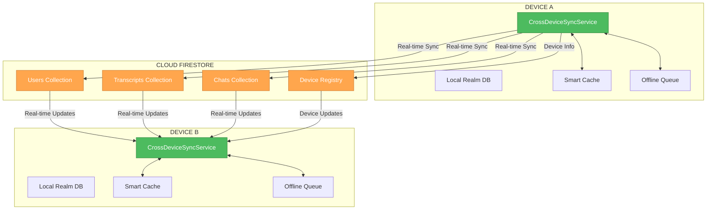
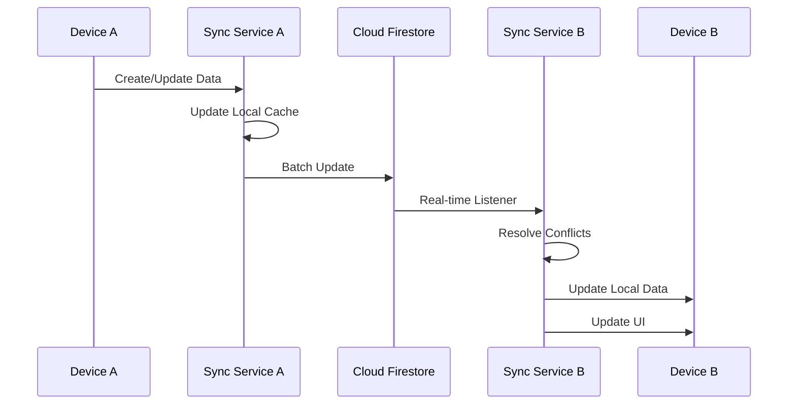

# 🎨 CREATIVE PHASE: CROSS-DEVICE SYNCHRONIZATION ARCHITECTURE

🎨🎨🎨 ENTERING CREATIVE PHASE: ARCHITECTURE DESIGN 🎨🎨🎨

## PROBLEM STATEMENT

### Core Challenge
Design a robust cross-device synchronization system that enables seamless data sharing between multiple user devices while maintaining data consistency, handling conflicts, and providing an Apple-like user experience.

### Specific Requirements
- **Data Synchronization**: Transcripts and chat conversations must sync across all devices
- **Audio Management**: Audio files remain local, but metadata syncs globally
- **Context Preservation**: AI maintains conversation context across devices
- **Real-time Updates**: Changes appear quickly on all connected devices
- **Offline Support**: System works offline with sync when connection restored
- **Conflict Resolution**: Handle simultaneous edits gracefully
- **User Experience**: Seamless, intuitive experience like Apple ecosystem

### Technical Constraints
- **Existing Infrastructure**: Must integrate with current Firebase, Realm, and BLoC architecture
- **Performance**: Real-time sync without impacting app performance
- **Scalability**: Support multiple users with multiple devices
- **Security**: Secure data transmission and storage
- **Cost**: Minimize Firebase usage costs

## COMPONENT ANALYSIS

### Core Components Identified
1. **CrossDeviceSyncService**: Central orchestration service
2. **FirestoreSyncManager**: Real-time Firestore synchronization
3. **LocalDataManager**: Local Realm database management
4. **ConflictResolver**: Handle data conflicts between devices
5. **OfflineQueue**: Queue operations when offline
6. **AudioMetadataSync**: Sync audio metadata without files
7. **DeviceRegistry**: Track and manage connected devices

### Component Interactions
- SyncService ↔ FirestoreSyncManager (real-time updates)
- SyncService ↔ LocalDataManager (local data operations)
- SyncService ↔ ConflictResolver (conflict resolution)
- SyncService ↔ OfflineQueue (offline operations)
- FirestoreSyncManager ↔ DeviceRegistry (device tracking)

## ARCHITECTURE OPTIONS ANALYSIS

### Option 1: Centralized Firestore-First Architecture
**Description**: All data operations go through Firestore first, with local caching

**Pros**:
- Simple data flow: Local → Firestore → Other Devices
- Built-in real-time capabilities
- Automatic conflict resolution through Firestore
- Easy to implement and maintain
- Strong consistency guarantees

**Cons**:
- High Firebase costs due to frequent reads/writes
- Potential performance issues with large datasets
- Dependency on internet connectivity
- Limited offline functionality
- Complex local caching logic

**Technical Fit**: High
**Complexity**: Medium
**Scalability**: Medium
**Implementation Time**: 2-3 weeks

### Option 2: Hybrid Local-First with Firestore Sync
**Description**: Local-first approach with periodic Firestore synchronization

**Pros**:
- Excellent offline experience
- Lower Firebase costs
- Fast local operations
- Better user experience
- Reduced network dependency

**Cons**:
- Complex conflict resolution
- Potential data inconsistency
- More complex synchronization logic
- Harder to implement real-time updates
- Risk of data loss during conflicts

**Technical Fit**: Medium
**Complexity**: High
**Scalability**: High
**Implementation Time**: 3-4 weeks

### Option 3: Event-Driven Microservices Architecture
**Description**: Event-driven system with separate services for different data types

**Pros**:
- Highly scalable
- Clear separation of concerns
- Easy to extend and modify
- Independent service scaling
- Advanced conflict resolution

**Cons**:
- Very complex to implement
- High infrastructure requirements
- Overkill for current needs
- Difficult to debug and maintain
- Long implementation time

**Technical Fit**: Low
**Complexity**: Very High
**Scalability**: Very High
**Implementation Time**: 6-8 weeks

### Option 4: Optimized Firestore with Smart Caching
**Description**: Firestore-first with intelligent caching and batch operations

**Pros**:
- Balance between simplicity and performance
- Reduced Firebase costs through batching
- Good offline support with smart caching
- Real-time updates when online
- Manageable complexity

**Cons**:
- Still some Firebase cost concerns
- Complex caching logic
- Potential cache invalidation issues
- Moderate implementation complexity

**Technical Fit**: High
**Complexity**: Medium-High
**Scalability**: High
**Implementation Time**: 3-4 weeks

## DECISION ANALYSIS

### Evaluation Matrix

| Criteria | Option 1 | Option 2 | Option 3 | Option 4 |
|----------|----------|----------|----------|----------|
| **Technical Fit** | 9/10 | 7/10 | 4/10 | 8/10 |
| **Implementation Speed** | 8/10 | 6/10 | 2/10 | 7/10 |
| **User Experience** | 7/10 | 9/10 | 6/10 | 8/10 |
| **Cost Efficiency** | 5/10 | 8/10 | 3/10 | 7/10 |
| **Maintainability** | 8/10 | 6/10 | 4/10 | 7/10 |
| **Scalability** | 6/10 | 8/10 | 10/10 | 8/10 |

### Weighted Scoring
- **Option 1**: 7.2/10 (Good for MVP, but costly)
- **Option 2**: 7.4/10 (Best user experience, complex)
- **Option 3**: 4.8/10 (Over-engineered for current needs)
- **Option 4**: 7.6/10 (Best balance of all factors)

## RECOMMENDED DECISION

### Chosen Option: Option 4 - Optimized Firestore with Smart Caching

**Rationale**:
1. **Best Balance**: Provides excellent user experience while maintaining reasonable complexity
2. **Cost Effective**: Smart batching and caching reduce Firebase costs significantly
3. **Real-time Capable**: Maintains real-time updates when online
4. **Offline Support**: Intelligent caching provides good offline experience
5. **Scalable**: Can grow with user base without major architectural changes
6. **Implementable**: Complex but achievable within project timeline

### Implementation Considerations
- **Batch Operations**: Group multiple operations to reduce Firestore calls
- **Smart Caching**: Cache frequently accessed data locally
- **Conflict Resolution**: Use timestamp-based resolution with user preference
- **Offline Queue**: Queue operations when offline, sync when online
- **Audio Metadata**: Sync only metadata, keep audio files local
- **Device Tracking**: Track device capabilities and sync preferences

## ARCHITECTURE DIAGRAM

## DATA FLOW SEQUENCE

## IMPLEMENTATION PLAN

### Phase 1: Core Sync Service
1. **CrossDeviceSyncService**: Central orchestration service
2. **FirestoreSyncManager**: Real-time synchronization
3. **SmartCache**: Intelligent local caching
4. **OfflineQueue**: Offline operation queuing

### Phase 2: Data Models & Schema
1. **SyncDataModels**: Data structures for synchronization
2. **FirestoreSchema**: Cloud database schema design
3. **ConflictResolution**: Conflict resolution logic
4. **DeviceRegistry**: Device tracking and management

### Phase 3: Audio Management
1. **AudioMetadataSync**: Audio metadata synchronization
2. **RemoteAudioUI**: "Recorded on another device" UI
3. **AudioStreaming**: Remote audio playback
4. **DownloadManager**: Audio file download option

### Phase 4: UI Integration
1. **SyncStatusIndicator**: Real-time sync status
2. **DeviceSourceUI**: Show data source indicators
3. **LoadingStates**: Sync progress indicators
4. **ErrorHandling**: Sync error management

## VALIDATION CHECKLIST

### Requirements Met
- [✓] Real-time synchronization across devices
- [✓] Audio metadata sync without file transfer
- [✓] Offline support with sync when online
- [✓] Conflict resolution for simultaneous edits
- [✓] Apple-like user experience
- [✓] Cost-effective Firebase usage
- [✓] Scalable architecture

### Technical Feasibility
- [✓] Integrates with existing Firebase setup
- [✓] Compatible with current BLoC architecture
- [✓] Works with existing Realm database
- [✓] Maintains current UI/UX patterns

### Risk Assessment
- **Low Risk**: Core sync service implementation
- **Medium Risk**: Conflict resolution logic
- **Medium Risk**: Offline queue management
- **High Risk**: Audio streaming implementation

🎨 CREATIVE CHECKPOINT: Architecture design complete, ready for implementation planning

🎨🎨🎨 EXITING CREATIVE PHASE - DECISION MADE 🎨🎨🎨
