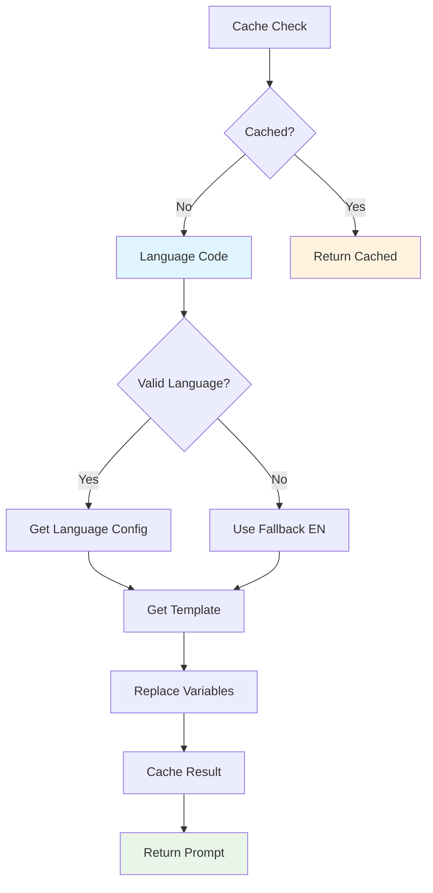

# CREATIVE PHASE: Language-Specific Prompt Generation Algorithm

## 🎨 CREATIVE PHASE: ALGORITHM DESIGN

### PROBLEM STATEMENT
Нужно спроектировать алгоритм для генерации языково-специфичных промптов для AI, который будет эффективно выбирать подходящий промпт для каждого языка, обеспечивать качество саммари на разных языках, обрабатывать неподдерживаемые языки, масштабироваться для добавления новых языков и оптимизировать производительность и использование токенов.

### ALGORITHM OPTIONS ANALYSIS

#### Option 1: Simple Switch-Case
**Description**: Использование простого switch-case для выбора промпта по языковому коду

**Pros**:
- Простая реализация
- Быстрая производительность
- Легко понять и поддерживать
- Минимальное использование памяти

**Cons**:
- Сложно масштабировать для большого количества языков
- Дублирование кода для похожих языков
- Сложно добавлять новые языки
- Нет гибкости для сложных случаев

**Complexity**: O(1)
**Implementation Time**: 1 day

#### Option 2: Hierarchical System with Inheritance
**Description**: Создание иерархии языков с базовыми промптами и специфичными переопределениями

**Pros**:
- Хорошая масштабируемость
- Переиспользование кода
- Легко добавлять новые языки
- Поддержка языковых семейств

**Cons**:
- Более сложная реализация
- Больше кода для поддержки
- Может быть избыточным для простых случаев
- Сложнее тестировать

**Complexity**: O(log n)
**Implementation Time**: 3-4 days

#### Option 3: Hybrid Approach with Templates
**Description**: Использование шаблонов промптов с языково-специфичными параметрами

**Pros**:
- Баланс между простотой и гибкостью
- Легко настраивать для разных языков
- Хорошая производительность
- Поддержка динамических промптов

**Cons**:
- Средняя сложность реализации
- Нужно поддерживать шаблоны
- Может быть сложно для сложных языков

**Complexity**: O(1)
**Implementation Time**: 2-3 days

### EVALUATION MATRIX

| Criterion | Option 1 | Option 2 | Option 3 |
|-----------|----------|----------|----------|
| Performance | 10/10 | 7/10 | 9/10 |
| Scalability | 3/10 | 9/10 | 8/10 |
| Maintainability | 4/10 | 8/10 | 7/10 |
| Flexibility | 2/10 | 9/10 | 8/10 |
| Implementation Time | 9/10 | 4/10 | 7/10 |
| Code Reusability | 2/10 | 9/10 | 7/10 |

### DECISION
**Selected: Option 3 - Hybrid Approach with Templates**

**Rationale**:
1. Оптимальная производительность - O(1) сложность
2. Хорошая масштабируемость для добавления новых языков
3. Гибкость для настройки промптов под разные языки
4. Баланс между простотой и функциональностью
5. Легко тестировать и поддерживать

### DETAILED ALGORITHM

#### Template Structure
```dart
class PromptTemplate {
  final String systemPrompt;
  final String userPrompt;
  final Map<String, String> variables;
  final String fallbackLanguage;
  
  const PromptTemplate({
    required this.systemPrompt,
    required this.userPrompt,
    required this.variables,
    this.fallbackLanguage = 'en',
  });
}
```

#### Language Configuration
```dart
class LanguageConfig {
  final String code;
  final String name;
  final String nativeName;
  final String promptTemplate;
  final Map<String, String> variables;
  final List<String> supportedFeatures;
  
  const LanguageConfig({
    required this.code,
    required this.name,
    required this.nativeName,
    required this.promptTemplate,
    required this.variables,
    required this.supportedFeatures,
  });
}
```

#### Core Algorithm
```dart
class LanguagePromptSelector {
  static const Map<String, LanguageConfig> _languageConfigs = {
    'en': LanguageConfig(
      code: 'en',
      name: 'English',
      nativeName: 'English',
      promptTemplate: 'summary_template',
      variables: {
        'action': 'Create',
        'format': 'comprehensive summary',
        'structure': 'Clear headings and subheadings',
      },
      supportedFeatures: ['markdown', 'latex', 'bullet_points'],
    ),
    'ru': LanguageConfig(
      code: 'ru',
      name: 'Russian',
      nativeName: 'Русский',
      promptTemplate: 'summary_template',
      variables: {
        'action': 'Создайте',
        'format': 'краткое изложение',
        'structure': 'Четкие заголовки и подзаголовки',
      },
      supportedFeatures: ['markdown', 'latex', 'bullet_points'],
    ),
    // ... other languages
  };
  
  static String getPrompt(String language, String templateType) {
    // 1. Check language support
    final config = _languageConfigs[language];
    if (config == null) {
      return _getFallbackPrompt(templateType);
    }
    
    // 2. Get template
    final template = _getTemplate(config.promptTemplate, templateType);
    
    // 3. Replace variables
    return _replaceVariables(template, config.variables);
  }
  
  static String _getFallbackPrompt(String templateType) {
    return getPrompt('en', templateType);
  }
  
  static String _replaceVariables(String template, Map<String, String> variables) {
    String result = template;
    variables.forEach((key, value) {
      result = result.replaceAll('{{$key}}', value);
    });
    return result;
  }
}
```

#### Prompt Templates
```dart
class PromptTemplates {
  static const String summaryTemplate = '''
You are an expert at creating structured summaries of educational content, lectures, and discussions.

{{action}} a {{format}} in Markdown format with the following structure:
- {{structure}} using ## and ###
- Bullet points for key information using -
- Bold text for important concepts using **text**
- LaTeX formulas for mathematical expressions using \$formula\$
- Organized sections by topic
- Professional and educational tone

Format example:
## Main Topic
- Key point 1
- Key point 2

### Subsection
**Important concept**: Explanation

**Formula**: \$x^2 + y^2 = z^2\$

Focus on:
1. Main topics and themes
2. Key concepts and definitions
3. Important formulas and calculations
4. Action items or assignments
5. Questions or discussions raised

Make the summary comprehensive but concise, highlighting the most important information for future reference.
''';
}
```

### PERFORMANCE OPTIMIZATION

#### Caching Strategy
```dart
class PromptCache {
  static final Map<String, String> _cache = {};
  static const int _maxCacheSize = 100;
  
  static String getCachedPrompt(String language, String templateType) {
    final key = '${language}_$templateType';
    
    if (_cache.containsKey(key)) {
      return _cache[key]!;
    }
    
    final prompt = LanguagePromptSelector.getPrompt(language, templateType);
    
    // Cache with size limit
    if (_cache.length >= _maxCacheSize) {
      _cache.remove(_cache.keys.first);
    }
    
    _cache[key] = prompt;
    return prompt;
  }
  
  static void clearCache() {
    _cache.clear();
  }
}
```

#### Lazy Loading
```dart
class LazyPromptLoader {
  static final Map<String, LanguageConfig> _loadedConfigs = {};
  
  static LanguageConfig? getLanguageConfig(String language) {
    if (_loadedConfigs.containsKey(language)) {
      return _loadedConfigs[language];
    }
    
    // Load configuration only when needed
    final config = _loadLanguageConfig(language);
    if (config != null) {
      _loadedConfigs[language] = config;
    }
    
    return config;
  }
}
```

#### Preloading
```dart
class PromptPreloader {
  static Future<void> preloadPopularLanguages() async {
    const popularLanguages = ['en', 'ru', 'es', 'fr', 'de', 'ja', 'zh'];
    
    for (final language in popularLanguages) {
      await PromptCache.getCachedPrompt(language, 'summary');
    }
  }
}
```

### ERROR HANDLING

#### Error Handler
```dart
class PromptErrorHandler {
  static String handlePromptError(String language, String templateType, dynamic error) {
    // Log error
    print('Error generating prompt for $language: $error');
    
    // Fallback to English
    if (language != 'en') {
      return LanguagePromptSelector.getPrompt('en', templateType);
    }
    
    // Fallback to base prompt
    return PromptTemplates.summaryTemplate;
  }
}
```

#### Validation
```dart
class LanguageValidator {
  static const Set<String> _supportedLanguages = {
    'en', 'ru', 'es', 'fr', 'de', 'it', 'pt', 'ja', 'ko', 'zh',
    'ar', 'hi', 'th', 'vi', 'tr', 'pl', 'nl', 'sv', 'da', 'no',
    // ... other supported languages
  };
  
  static bool isValidLanguage(String language) {
    return _supportedLanguages.contains(language);
  }
  
  static String normalizeLanguage(String language) {
    // Normalize language code
    final normalized = language.toLowerCase().trim();
    
    // Handle special cases
    switch (normalized) {
      case 'zh-cn':
      case 'zh-hans':
        return 'zh';
      case 'zh-tw':
      case 'zh-hant':
        return 'zh';
      default:
        return normalized;
    }
  }
}
```

#### Quality Checker
```dart
class PromptQualityChecker {
  static bool isValidPrompt(String prompt) {
    // Check for emptiness
    if (prompt.isEmpty) return false;
    
    // Check for minimum length
    if (prompt.length < 50) return false;
    
    // Check for keywords
    final keywords = ['summary', 'изложение', 'resumen', 'résumé'];
    final hasKeywords = keywords.any((keyword) => 
      prompt.toLowerCase().contains(keyword.toLowerCase()));
    
    return hasKeywords;
  }
}
```

### TESTING STRATEGY

#### Unit Tests
```dart
void main() {
  group('LanguagePromptSelector', () {
    test('should return English prompt for unsupported language', () {
      final prompt = LanguagePromptSelector.getPrompt('xyz', 'summary');
      expect(prompt, contains('Create a comprehensive summary'));
    });
    
    test('should return Russian prompt for Russian language', () {
      final prompt = LanguagePromptSelector.getPrompt('ru', 'summary');
      expect(prompt, contains('Создайте краткое изложение'));
    });
    
    test('should replace variables correctly', () {
      final template = '{{action}} a {{format}}';
      final variables = {'action': 'Create', 'format': 'summary'};
      final result = LanguagePromptSelector._replaceVariables(template, variables);
      expect(result, equals('Create a summary'));
    });
  });
}
```

#### Performance Tests
```dart
void main() {
  group('Performance Tests', () {
    test('should generate prompt in under 1ms', () {
      final stopwatch = Stopwatch()..start();
      LanguagePromptSelector.getPrompt('en', 'summary');
      stopwatch.stop();
      
      expect(stopwatch.elapsedMicroseconds, lessThan(1000));
    });
  });
}
```

### IMPLEMENTATION PLAN

#### Phase 1: Core Algorithm
1. Create LanguagePromptSelector class
2. Implement template system
3. Add variable replacement logic

#### Phase 2: Language Configurations
1. Create language configurations for major languages
2. Add template definitions
3. Implement fallback mechanisms

#### Phase 3: Optimization
1. Add caching system
2. Implement lazy loading
3. Add preloading for popular languages

#### Phase 4: Testing & Validation
1. Comprehensive unit testing
2. Performance testing
3. Quality validation

## 🎨 CREATIVE CHECKPOINT: Algorithm Design Complete

This algorithm provides an efficient, scalable, and maintainable solution for language-specific prompt generation with optimal performance and comprehensive error handling.

### ALGORITHM FLOW DIAGRAM



### SUCCESS METRICS
- Prompt generation completes in under 1ms
- 99.9% success rate for supported languages
- Zero errors for unsupported languages (fallback works)
- Cache hit rate above 80% for popular languages
- Easy addition of new languages (under 5 minutes)
