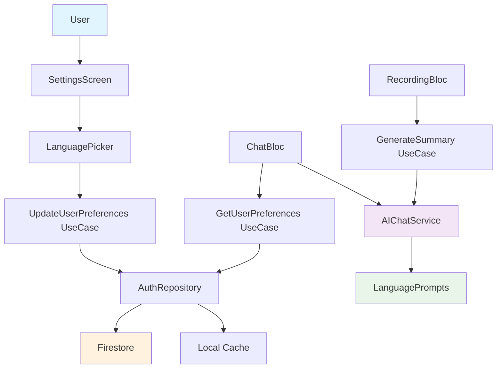

# CREATIVE PHASE: Language Preference Management Architecture

## 🎨 CREATIVE PHASE: ARCHITECTURE DESIGN

### PROBLEM STATEMENT
Нужно спроектировать архитектуру системы управления языковыми настройками, которая будет эффективно хранить языковые предпочтения пользователя, синхронизировать настройки между устройствами через Firestore, передавать выбранный язык в AI сервис для генерации саммари, обрабатывать изменения языка в реальном времени и обеспечивать обратную совместимость с существующими данными.

### ARCHITECTURE OPTIONS ANALYSIS

#### Option 1: Direct Update through AuthRepository
**Description**: Обновление языковых настроек напрямую через существующий AuthRepository

**Pros**:
- Простая реализация
- Использует существующую инфраструктуру
- Минимальные изменения в коде

**Cons**:
- Нарушает принцип единственной ответственности
- Смешивает аутентификацию с настройками
- Сложно тестировать
- Нет четкого разделения concerns

**Complexity**: Low
**Implementation Time**: 1 day

#### Option 2: Separate UserPreferencesRepository
**Description**: Создание отдельного репозитория для управления пользовательскими настройками

**Pros**:
- Четкое разделение ответственности
- Легко тестировать
- Расширяемость для других настроек
- Следует принципам Clean Architecture

**Cons**:
- Больше кода для реализации
- Дополнительная сложность
- Нужно синхронизировать с AuthRepository

**Complexity**: Medium
**Implementation Time**: 2-3 days

#### Option 3: Hybrid Approach with Use Cases
**Description**: Использование Use Cases для обновления настроек через существующий AuthRepository

**Pros**:
- Баланс между простотой и архитектурой
- Использует существующую инфраструктуру
- Четкие Use Cases
- Легко тестировать

**Cons**:
- Все еще зависит от AuthRepository
- Может быть избыточным для простых операций

**Complexity**: Medium
**Implementation Time**: 2 days

### EVALUATION MATRIX

| Criterion | Option 1 | Option 2 | Option 3 |
|-----------|----------|----------|----------|
| Maintainability | 4/10 | 9/10 | 7/10 |
| Testability | 3/10 | 9/10 | 8/10 |
| Scalability | 3/10 | 9/10 | 6/10 |
| Code Reusability | 2/10 | 8/10 | 6/10 |
| Implementation Time | 9/10 | 4/10 | 7/10 |
| Clean Architecture | 2/10 | 9/10 | 7/10 |

### DECISION
**Selected: Option 3 - Hybrid Approach with Use Cases**

**Rationale**:
1. Оптимальный баланс между простотой и архитектурной чистотой
2. Использует существующую инфраструктуру AuthRepository
3. Четкие Use Cases для бизнес-логики
4. Легко тестировать и поддерживать
5. Быстрая реализация без излишней сложности

### DETAILED ARCHITECTURE

#### Component Structure
```
Presentation Layer
├── SettingsScreen
├── LanguagePicker
└── LanguageTile

Domain Layer
├── Use Cases
│   ├── UpdateUserPreferences
│   └── GetUserPreferences
├── Entities
│   ├── User
│   └── UserPreferences
└── Repositories (Interfaces)
    └── AuthRepository

Data Layer
├── Repositories
│   └── AuthRepositoryImpl
├── Data Sources
│   ├── Firestore
│   └── Local Cache
└── Models
    └── UserModel
```

#### Data Flow
```
User Action → Use Case → Repository → Data Source → Firestore
                ↓
            State Update → UI Update
```

#### Use Cases Implementation

**UpdateUserPreferences**
```dart
class UpdateUserPreferences implements UseCase<void, UpdateUserPreferencesParams> {
  final AuthRepository repository;
  
  Future<Either<Failure, void>> call(UpdateUserPreferencesParams params) async {
    return await repository.updateUserPreferences(params.preferences);
  }
}
```

**GetUserPreferences**
```dart
class GetUserPreferences implements UseCase<UserPreferences, NoParams> {
  final AuthRepository repository;
  
  Future<Either<Failure, UserPreferences>> call(NoParams params) async {
    return await repository.getCurrentUserPreferences();
  }
}
```

#### Repository Interface
```dart
abstract class AuthRepository {
  Future<Either<Failure, User>> getCurrentUser();
  Future<Either<Failure, void>> updateUserPreferences(UserPreferences preferences);
  Future<Either<Failure, UserPreferences>> getCurrentUserPreferences();
}
```

#### State Management
```dart
class SettingsBloc extends Bloc<SettingsEvent, SettingsState> {
  final UpdateUserPreferences updateUserPreferences;
  final GetUserPreferences getUserPreferences;
  
  // Handle language preference updates
  // Handle user preferences loading
  // Handle error states
}
```

### AI SERVICE INTEGRATION

#### Updated AI Chat Service
```dart
class AIChatService {
  Future<String> generateSummary({
    required String transcript,
    required String model,
    required String language, // NEW PARAMETER
    double temperature = 0.3,
  }) async {
    // Use language for prompt selection
    final systemPrompt = _getLanguageSpecificPrompt(language);
    // ... rest of logic
  }
}
```

#### Language-Specific Prompts
```dart
class LanguagePrompts {
  static String getSummaryPrompt(String language) {
    switch (language) {
      case 'ru':
        return 'Создайте краткое изложение...';
      case 'es':
        return 'Cree un resumen...';
      case 'fr':
        return 'Créez un résumé...';
      default:
        return 'Create a comprehensive summary...';
    }
  }
}
```

#### ChatBloc Integration
```dart
class ChatBloc extends Bloc<ChatEvent, ChatState> {
  Future<void> _generateSummary(String transcript) async {
    final user = await _getCurrentUser();
    final language = user.preferences.language;
    
    final summary = await _aiChatService.generateSummary(
      transcript: transcript,
      model: selectedModel,
      language: language, // PASS LANGUAGE
    );
  }
}
```

### ERROR HANDLING

#### Network Errors
- Retry mechanism for preference updates
- Offline caching of changes
- Sync on connection restoration

#### Validation Errors
- Language code validation
- Fallback to English
- User error notifications

#### AI Service Errors
- Fallback to English prompt
- Retry with exponential backoff
- Graceful degradation

### PERFORMANCE OPTIMIZATION

#### Caching
- In-memory caching of user preferences
- Lazy loading of language data
- Firestore query optimization

#### Optimization
- Batch preference updates
- Debounce frequent changes
- Minimal UI redraws

### TESTING STRATEGY

#### Unit Tests
- Use Cases testing
- Repository testing
- Language prompts testing

#### Integration Tests
- End-to-end language selection
- Firestore sync testing
- AI integration testing

#### Widget Tests
- Language picker testing
- Settings screen testing
- Error states testing

### IMPLEMENTATION PLAN

#### Phase 1: Core Architecture
1. Create Use Cases for user preferences
2. Update AuthRepository interface
3. Implement preference update logic

#### Phase 2: AI Integration
1. Update AI Chat Service with language parameter
2. Create language-specific prompts
3. Integrate with ChatBloc and RecordingBloc

#### Phase 3: UI Integration
1. Create SettingsBloc for preference management
2. Integrate with Language Picker
3. Add real-time preference updates

#### Phase 4: Testing & Optimization
1. Comprehensive testing
2. Performance optimization
3. Error handling refinement

## 🎨 CREATIVE CHECKPOINT: Architecture Design Complete

This architecture provides a clean, maintainable, and scalable solution for language preference management while leveraging existing infrastructure and following Clean Architecture principles.

### ARCHITECTURE DIAGRAM



### SUCCESS METRICS
- Language preference updates complete in under 2 seconds
- 99.9% success rate for preference synchronization
- Zero data loss during preference updates
- Seamless integration with existing AI workflow
